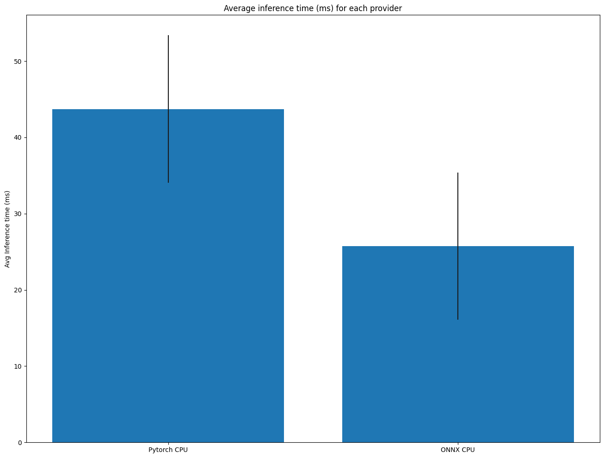
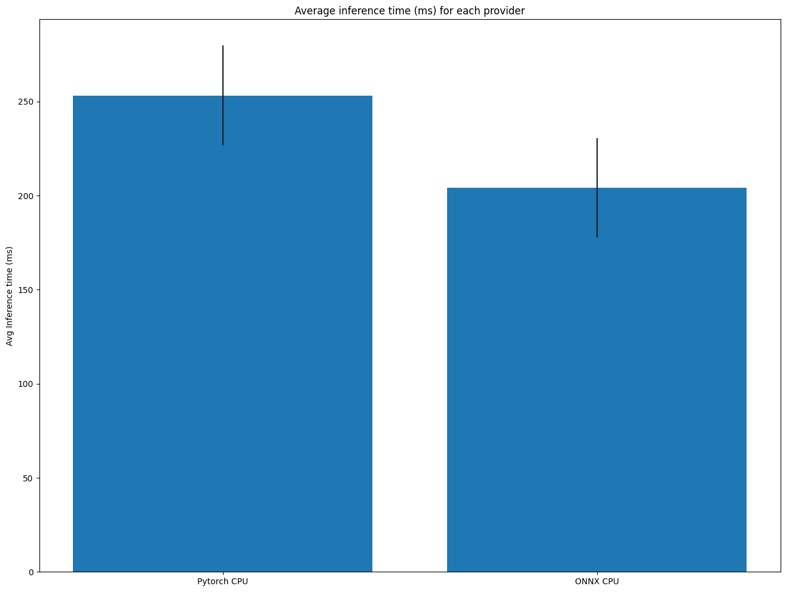

# onnx_transformers

Accelerated NLP pipelines for fast inference 🚀 on CPU. Built with 🤗Transformers and ONNX runtime.

## Installation:
---

```bash
pip install git+https://github.com/patil-suraj/onnx_transformers
```

## Usage:
---

> *NOTE* : This is an experimental project and only tested with PyTorch

The pipeline API is similer to transformers pipeline with just few differences which are explained below.
```python3
from onnx_transformers import pipeline

# Initialize a pipeline by passing the task name and 
# set onnx to True (default value is also True)
>>> nlp = pipeline("sentiment-analysis", onnx=True)
>>> nlp("Transformers and onnx runtime is an awesome combo!")
[{'label': 'POSITIVE', 'score': 0.999721109867096}]  
```

Or provide a different model using the `model` argument.

```python3
from onnx_transformers import pipeline

>>> nlp = pipeline("question-answering", model="deepset/roberta-base-squad2", onnx=True)
>>> nlp({
  "question": "What is ONNX Runtime ?", 
  "context": "ONNX Runtime is a highly performant single inference engine for multiple platforms and hardware"
})
{'answer': 'highly performant single inference engine for multiple platforms and hardware', 'end': 94, 'score': 0.751201868057251, 'start': 18}
```

Set `onnx` to `False` for standard torch inference.

You can create `Pipeline` objects for the following down-stream tasks:

 - `feature-extraction`: Generates a tensor representation for the input sequence
 - `ner`: Generates named entity mapping for each word in the input sequence.
 - `sentiment-analysis`: Gives the polarity (positive / negative) of the whole input sequence. Can be used for any text classfication model.
 - `question-answering`: Provided some context and a question refering to the context, it will extract the answer to the question in the context.
 - `zero-shot-classification`:
  

Calling the pipeline for the first time loads the model, creates the onnx graph and caches it for future use. Due to this the first load will take some time. Subsequent calls to the same model will load the onnx graph automatically from the cache.

The key difference between HF pipeline and onnx_transformers is that the `model` parameter should always be a `string` (path or url to the saved model). Also the `zero-shot-classification` pipeline here uses `roberta-large-mnli` as default model instead of `facebook/bart-large-mnli` as BART is not yet tested with onnx runtime.


## Benchmarks
---

For detailed benchmarks and other information refer to this blog post and notebook.
- [Accelerate your NLP pipelines using Hugging Face Transformers and ONNX Runtime](https://medium.com/microsoftazure/accelerate-your-nlp-pipelines-using-hugging-face-transformers-and-onnx-runtime-2443578f4333)
- [Exporting 🤗 transformers model to ONNX](https://github.com/huggingface/transformers/blob/master/notebooks/04-onnx-export.ipynb)

To benchmark the pipelines in this repo, see the [benchmark_pipelines](notebooks/benchmark_pipelines.ipynb) notebook. 
>(Note: These are not yet comprehensive benchmarks.)

**Benchmark `feature-extraction` pipeline** 




**Benchmark `question-answering` pipeline**


